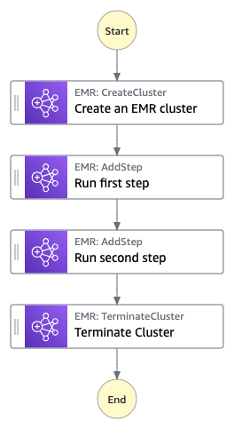

# Manage an Amazon EMR Job

This workflow demonstrates Amazon EMR and AWS Step Functions integration. It shows how to create an Amazon EMR cluster, add multiple setps and run them, and then terminate the cluster.

Important: this application uses various AWS services and there are costs associated with these services after the Free Tier usage - please see the [AWS Pricing page](https://aws.amazon.com/pricing/) for details. You are responsible for any AWS costs incurred. No warranty is implied in this example.

## Requirements

* [Create an AWS account](https://portal.aws.amazon.com/gp/aws/developer/registration/index.html) if you do not already have one and log in. The IAM user that you use must have sufficient permissions to make necessary AWS service calls and manage AWS resources.
* [AWS CLI](https://docs.aws.amazon.com/cli/latest/userguide/install-cliv2.html) installed and configured
* [Git Installed](https://git-scm.com/book/en/v2/Getting-Started-Installing-Git)
* [AWS Cloud Developent Kit](https://docs.aws.amazon.com/cdk/v2/guide/getting_started.html#getting_started_install) (AWS CDK) installed

## Deployment Instructions

1. Create a new directory, navigate to that directory in a terminal and clone the GitHub repository.
    ``` 
    git clone https://github.com/aws-samples/step-functions-workflows-collection
    ```
2. Change directory to the pattern directory.
    ```
    cd manage-emr-job-cdk
    ```
3. From the command line, create a virtual environment.
    ```
    python3 -m venv .venv
    ```
4. Then, activate your virtual environment. 

    ```
    source .venv/bin/activate
    ```

If you are a Windows platform, you would activate the virtualenv like this.

    ```
    .venv\Scripts\activate.bat
    ```
5. Once the virtual environment is activated, you can install the required dependencies.

    ```
    pip install -r requirements.txt
    ```
6. From the command line, deploy the stack by running the following command.
    ```
    cdk deploy
    ```
7. You will receive the following prompt. Select `y` to deploy.
    ```
    Do you wish to deploy these changes (y/n)? y
    ```

## How it Works

The workflow creates an EMR cluster, runs two steps on the EMR cluster, and then terminates the cluster.

## Image



## Testing

In order to successfully validate the Step Functions workflow, follow the steps below:

1. Deploy the stack via CDK.
2. Invoke the State Machine via the console or the AWS CLI. No input is required for this.
3. The state machine will go through all steps successfully by creating an EMR cluster, running both steps on the cluster, and then terminating the cluster. 

## Cleanup
 
1. Delete the stack.
    ```bash
    cdk destroy
    ```
2. You will receive the following prompt. Select `y` to delete the stack.
    ```bash
    Are you sure you want to delete: manage-emr-job (y/n)? y
    ```
----
Copyright 2023 Amazon.com, Inc. or its affiliates. All Rights Reserved.

SPDX-License-Identifier: MIT-0
